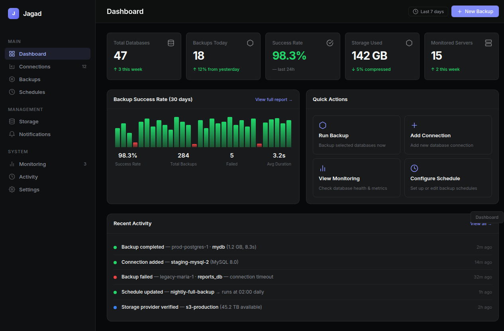
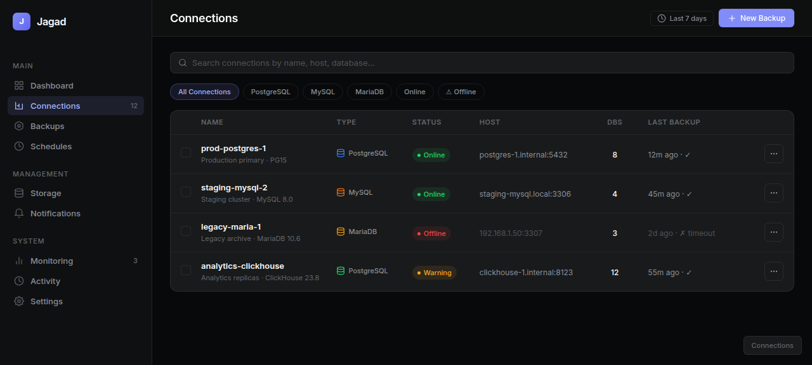
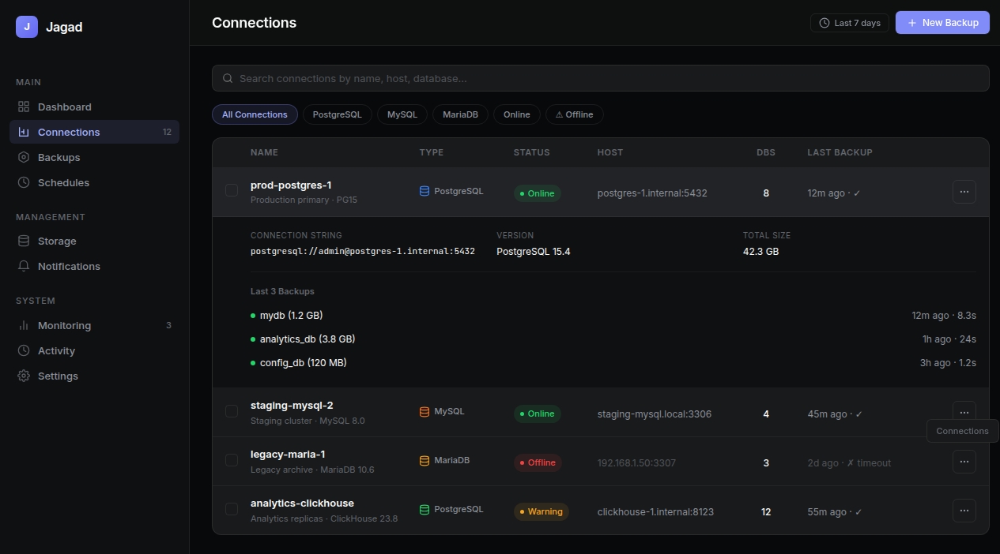
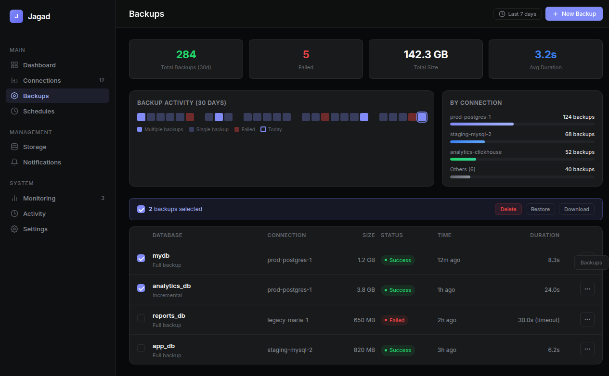
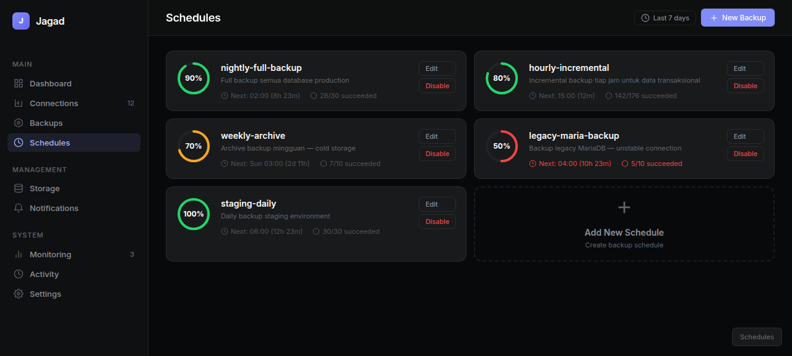

# PRD: Jagad Revamp v2.0

**Status:** Draft  
**Author:** Hermes  
**Last Updated:** 2026-06-19  
**Related:** Monitoring v3 Mockup, Schema Split Discussion

---

## 1. Executive Summary

Jagad saat ini menggunakan satu schema (`public`) untuk menyimpan *semua* data — baik data relasional (connections, backups, schedules) maupun data time-series monitoring (health_checks, db_metrics, performance_metrics). Hal ini menyebabkan:

- **Retention management** sulit (data time-series butuh auto-delete, data relasional butuh persist)
- **Backup/restore** membengkak (ikut backup data metrik yang sebenarnya bisa diregenerasi)
- **Permission granularity** rendah
- **Compression policy** tidak bisa di-target per use-case

Selain itu, UI masih perlu di-improve dari sisi usability — dashboard sebagai landing page kurang impact, connections tidak punya quick-filter/search, backups tidak punya visual timeline, dan schedules tidak punya visual health indicator.

Revamp ini mencakup **schema restructure** (database) + **UI overhaul** (frontend) secara bersamaan.

---

## 2. Problem Statement

### 2.1 Database
1. **Single schema (`public`)** mencampur data dengan karakteristik retention berbeda
2. **TimescaleDB hypertable** tidak bisa di-compress/retention secara independen dari tabel relasional
3. **Backup database** menjadi besar karena ikut backup data metrik (yang bisa dibuang setelah 90 hari)
4. **Migrasi ke depannya** makin sulit karena schema `public` sudah penuh

### 2.2 UI
1. **Dashboard** — flat, cuma stat row + activity + recent backups table, kurang impactful sebagai landing page
2. **Connections** — plain table tanpa search/filter, perlu page-switching buat liat detail
3. **Backups** — cuma table list, ga ada visual timeline atau batch action
4. **Schedules** — card biasa tanpa health indicator atau countdown
5. **Monitoring tabs** — nama "Grid/Analytics/List" kurang intuitif

---

## 3. Goals & Success Metrics

| Goal | Metric | Current | Target |
|---|---|---|---|
| Schema separation | Number of schemas | 1 (`public`) | 3+ (`jagad`, `metrics`, `logs`) |
| Data retention | Auto-drop metrics >90 days | Manual | Automatic via TimescaleDB policy |
| UI clarity | User confusion on tab names | Medium | Zero |
| Dashboard usefulness | Actions taken from dashboard | Low | High (KPI-driven) |
| Connections UX | Time to find connection info | ~30s (page switch) | ~5s (inline expand) |
| Backups visibility | Understanding backup health | Low (table only) | High (calendar + stats) |

---

## 4. Schema Architecture

### 4.1 Target Schema Design

```
jagad                — Relational data (persistent, no auto-delete)
├── connections
├── connection_databases
├── storage_providers
├── schedules
├── backups
├── restores
├── notifications
├── encryption_keys
├── app_settings
└── users / sessions     (future)

metrics              — TimescaleDB hypertables (auto-retention 90d, auto-compress 7d)
├── health_checks
├── db_metrics
├── performance_metrics
├── autovacuum_info
├── lock_info
├── replication_lag
└── table_metrics

logs                 — Audit trail (auto-retention 365d)
├── audit_logs
```

### 4.2 Migration Strategy

1. **Create schemas** — `CREATE SCHEMA jagad; CREATE SCHEMA metrics; CREATE SCHEMA logs;`
2. **Create tables** di schema baru (dengan struktur identik atau improved)
3. **Migrate data** — INSERT INTO ... SELECT FROM public ...
4. **Update application queries** — ganti `public.tabel` jadi `jagad.tabel` atau `metrics.tabel`
5. **Drop old public tables** (setelah verified)
6. **Update TimescaleDB policies** — compression, retention per hypertable

**Rollback plan:** Keep `public` tables during migration period. Dual-write if needed.

### 4.3 Audit Log (Schema `logs`)

Tabel `logs.audit_logs`:
```sql
CREATE TABLE logs.audit_logs (
    id BIGSERIAL PRIMARY KEY,
    actor_id TEXT NOT NULL,           -- user ID or 'system'
    action TEXT NOT NULL,             -- 'backup.run', 'connection.create', 'schedule.update'
    target_type TEXT NOT NULL,        -- 'connection', 'backup', 'schedule', etc.
    target_id TEXT,
    metadata JSONB,                   -- request context (diff, status, error)
    ip_address INET,
    created_at TIMESTAMPTZ DEFAULT NOW()
);
```

---

## 5. UI Architecture — Pages & Components

### 5.1 Global Design System
- **Theme:** Dark Linear-inspired (`#08090a` canvas, `#0f1011` surface)
- **Accent:** Jagad indigo/violet (`#818cf8`)
- **Typography:** Inter UI, JetBrains Mono for code/monospace
- **Border technique:** Vercel shadow-border (semi-transparent white)
- **Status colors:** Green `#22d66a`, Yellow `#f5a623`, Red `#ef4444`, Blue `#3b82f6`

### 5.2 Navigation (Sidebar)

```
MAIN
├── Dashboard          ← KPI-driven landing page
├── Connections [12]   ← Search + filter + expandable rows
├── Backups            ← Timeline calendar + batch actions
├── Schedules          ← Ring indicator cards

MANAGEMENT
├── Storage            ← CRUD (existing, minor polish)
├── Notifications      ← CRUD (existing, minor polish)

SYSTEM
├── Monitoring [3]     ← Tabs: Overview | Performance | Connections
├── Activity           ← Timeline (existing, minor polish)
├── Settings           ← Form (existing)
```

### 5.3 Page: Dashboard
**Problem:** Flat, low information density, no quick actions.

**Solution:**
- **KPI Row** (5 cards): Total Databases, Backups Today, Success Rate, Storage Used, Monitored Servers — each with mini trend arrow
- **Backup Success Chart:** 30-day bar chart (green=success, red=fail) + summary stats
- **Quick Actions Grid** (4 cards): Run Backup, Add Connection, View Monitoring, Configure Schedule
- **Recent Activity Feed:** Timeline of latest events (color-coded by type)

### 5.4 Page: Connections
**Problem:** Plain table, no filter, need page switch for details.

**Solution:**
- **Search bar** — filter by name, host, or database
- **Filter pills** — All / PostgreSQL / MySQL / MariaDB / Online / Offline
- **Status badges** — Online 🟢 / Warning 🟡 / Offline 🔴
- **Expandable rows** — klik row → show: connection string, version, total size, + 3 recent backups
- **DB count** per connection, **last backup status** visible in table

### 5.5 Page: Backups
**Problem:** Table only, no visual overview, no batch actions.

**Solution:**
- **Stats row** — Total Backups (30d), Failed, Total Size, Avg Duration
- **Timeline Calendar** — 30-day heatmap grid (dark = backup ran, red = failed, outlined = today)
- **By Connection** — distribution bars showing backup count per connection
- **Batch Actions Bar** — check multiple backups → Delete / Restore / Download
- **Enhanced table** — database name, connection, size, status badge, time, duration

### 5.6 Page: Schedules
**Problem:** Static cards, no health visibility.

**Solution:**
- **Schedule cards** with SVG ring indicator (success rate 0-100%)
  - Green ring (≥80%), Yellow ring (50-79%), Red ring (<50%)
  - Center percentage label
- **Next run countdown** — "Next: 02:00 (8h 23m)"
- **Success ratio** — "28/30 succeeded"
- **Edit / Disable** buttons per card
- **Add New Schedule** — dashed border card at bottom

### 5.7 Monitoring Tabs Rename

| Old | New | Rationale |
|---|---|---|
| Grid | Overview | Ini view utama dashboard monitoring |
| Analytics | Performance | Fokus ke query perf, trends, charts |
| List | Connections | Daftar koneksi dengan filter & search |

---

## 6. Non-Functional Requirements

| Area | Requirement |
|---|---|
| **Performance** | Dashboard KPI load < 500ms, table pagination < 200ms |
| **Schema migration** | Zero-downtime migration path (dual-write support) |
| **Retention** | Metrics auto-purge after 90 days via TimescaleDB policy |
| **Audit** | All write operations logged to `logs.audit_logs` |
| **Backward compat** | Old API endpoints continue working during migration |
| **Mobile** | Sidebar collapses on < 1024px, tables scroll horizontally |

---

## 7. Implementation Phases

### Phase 1: Schema Split (Database)
- [ ] Create schemas (`jagad`, `metrics`, `logs`)
- [ ] Migrate timescale hypertables to `metrics` schema
- [ ] Migrate relational tables to `jagad` schema
- [ ] Create `logs.audit_logs` table + triggers
- [ ] Update application DB queries
- [ ] Drop old `public` tables (after validation)

### Phase 2: UI Revamp — Core Pages
- [ ] Dashboard — KPI row, chart, quick actions, activity feed
- [ ] Connections — search, filters, status badges, expandable rows
- [ ] Backups — timeline calendar, stats, batch actions
- [ ] Schedules — ring indicators, countdown, health cards
- [ ] Update CSS variables & design tokens

### Phase 3: UI Revamp — Polish
- [ ] Monitoring tabs rename (Overview | Performance | Connections)
- [ ] Storage page polish
- [ ] Notifications page polish
- [ ] Activity page polish
- [ ] Settings page polish

### Phase 4: Testing & Launch
- [ ] Migration test on staging
- [ ] UI regression testing
- [ ] Performance testing
- [ ] Rollback drill

---

## 8. Mockup References

Berikut screenshot mockup revamp UI Jagad — bisa dijadikan referensi implementasi:

### Dashboard

*KPI row, backup chart 30d, quick actions grid, activity feed*

### Connections

*Search bar, filter pills, status badges, expandable rows*

### Connections — Expanded

*Expandable row dengan connection string, version, total size, recent backups*

### Backups

*Stats row, timeline calendar, connection distribution, batch actions*

### Schedules

*Ring indicator, next run countdown, success ratio, edit/disable*

---

## 9. Appendix

### 9.1 Current Schema (Baseline)

```
public (16 tables)
├── 9 Regular Tables
│   ├── connections
│   ├── connection_databases
│   ├── storage_providers
│   ├── schedules
│   ├── backups
│   ├── restores
│   ├── notifications
│   ├── encryption_keys
│   └── app_settings
└── 7 Hypertables
    ├── health_checks (Layer 1, 5min interval)
    ├── db_metrics (Layer 2, 1h interval)
    ├── performance_metrics
    ├── autovacuum_info
    ├── lock_info
    ├── replication_lag
    └── table_metrics
```

### 9.2 Technology Stack
- **Backend:** Go
- **Database:** PostgreSQL + TimescaleDB
- **Frontend:** Vanilla JS SPA (HTML + CSS)
- **Container:** Docker (jagad-api, jagad-ui, jagad-db)
- **Icons:** Lucide (inline SVG)
